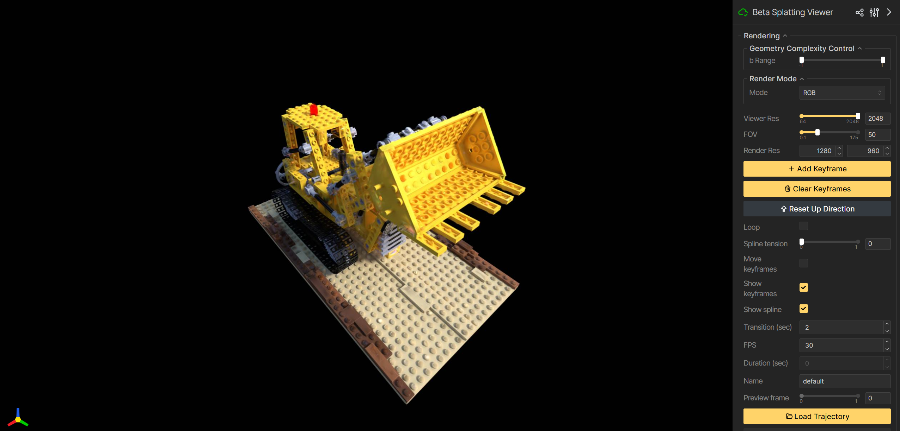

# Deformable Beta Splatting

[](https://rongliu-leo.github.io/beta-splatting/)
[](https://arxiv.org/abs/2501.18630)
[](https://paperswithcode.com/sota/novel-view-synthesis-on-nerf?p=deformable-beta-splatting)


<span class="author-block">
  <a href="https://rongliu-leo.github.io/">Rong Liu*</a>,
</span>
<span class="author-block">
  <a href="">Dylan Sun*</a>,
</span>
<span class="author-block">
  <a href="https://www.linkedin.com/in/meida-chen-938a265b/">Meida Chen</a>,
</span>
<span class="author-block">
  <a href="https://yuewang.xyz/">Yue Wang†</a>,
</span>
<span class="author-block">
  <a href="https://scholar.google.com/citations?user=JKWxGfsAAAAJ&hl=en">Andrew Feng†</a>
</span>

(*Co-first authors, equal technical contribution; †Co-advisors, equal leading contribution.)


Abstract: *3D Gaussian Splatting (3DGS) has advanced radiance field reconstruction by enabling real-time rendering. However, its reliance on Gaussian kernels for geometry and low-order Spherical Harmonics (SH) for color encoding limits its ability to capture complex geometries and diverse colors.
We introduce Deformable Beta Splatting (DBS), a deformable and compact approach that enhances both geometry and color representation. DBS replaces Gaussian kernels with deformable Beta Kernels, which offer bounded support and adaptive frequency control to capture fine geometric details with higher fidelity while achieving better memory efficiency. In addition, we extended the Beta Kernel to color encoding, which facilitates improved representation of diffuse and specular components, yielding superior results compared to SH-based methods. Furthermore, Unlike prior densification techniques that depend on Gaussian properties, we mathematically prove that adjusting regularized opacity alone ensures distribution-preserved Markov chain Monte Carlo (MCMC), independent of the splatting kernel type. Experimental results demonstrate that DBS achieves state-of-the-art visual quality while utilizing only 45\% of the parameters and rendering 1.5x faster than 3DGS-MCMC, highlighting the superior performance of DBS for real-time radiance field rendering.*

## Quickstart

This project is built on top of the [Original 3DGS](https://github.com/graphdeco-inria/gaussian-splatting), [3DGS-MCMC](https://github.com/ubc-vision/3dgs-mcmc) and [gsplat](https://github.com/nerfstudio-project/gsplat) code bases. The authors are grateful to the original authors for their open-source codebase contributions.

### Installation Steps

1. **Clone the Repository:**
   ```sh
   git clone --single-branch --branch main https://github.com/RongLiu-Leo/beta-splatting.git
   cd beta-splatting
   ```
1. **Set Up the Conda Environment:**
    ```sh
    conda create -y -n beta_splatting python=3.10
    conda activate beta_splatting
    ```
1. **Install [Pytorch](https://pytorch.org/get-started/locally/) (Based on Your CUDA Version)**
    ```sh
    pip3 install torch torchvision torchaudio --index-url https://download.pytorch.org/whl/cu118
    ```
1. **Install Dependencies and Submodules:**
    ```sh
    pip install .
    ```

### Train a Beta Model
```shell
python train.py -s <path to COLMAP or NeRF Synthetic dataset>
```
<details>
<summary><span style="font-weight: bold;">Important Command Line Arguments for train.py</span></summary>

  #### --source_path / -s
  Path to the source directory containing a COLMAP or Synthetic NeRF data set.
  #### --cap_max
  Number of primitives that the final model produces.
  #### --model_path / -m 
  Path where the trained model should be stored.
  #### --resolution / -r
  Image resolution downsample factor.
  #### --white_background / -w
  Whether use white background.
  #### --eval
  Whether use evaluation mode.
  #### --sh_degree
  Degree used in Spherical Harmonics (SH).
  #### --sb_number
  Light source number used in Spherical Betas (SB).

</details>
<br>

For example, simply run
```shell
python train.py -s lego --cap_max 300000 --eval
```
You should be able to visualize your first Beta Model like this



### Compress a Trained Beta Model
```shell
python compress.py --ply <path to a trained Beta Model ply file>
# It will produce a folder named "png" for a Beta Model, saving 5x~6x storage compared to a ply file
```

### Visualize a Trained Beta Model
```shell
python view.py --ply <path to a trained Beta Model ply file>
# or
python view.py --png <path to a compressed Beta Model png folder>
```
<details>
<summary><span style="font-weight: bold;">Important Command Line Arguments for view.py</span></summary>

  #### --ply
  Path to a trained Beta Model.
  #### --port
  Port to connect to the viewer.

</details>
<br>

### Evaluate a Trained Beta Model
```shell
python eval.py -s <path to COLMAP or NeRF Synthetic dataset> -m <path to trained model directory> 
```
<details>
<summary><span style="font-weight: bold;">Important Command Line Arguments for eval.py</span></summary>

  #### --source_path / -s
  Path to the source directory containing a COLMAP or Synthetic NeRF data set.
  #### --model_path / -m 
  Path to the trained model directory where the trained model should be stored (```output/<random>``` by default).
  #### --iteration
  Loading trained iteration for rendering. "Best" by default.

</details>
<br>

### Produce benchmark results
```shell
python benchmark.py -<dataset> <path to dataset>
#For example, python benchmark.py -m360 <path to Mip-NeRF 360 dataset>
```
<details>
<summary><span style="font-weight: bold;">Important Command Line Arguments for benchmark.py</span></summary>

  #### --output_path
  Path to output directory. "eval" by default.
  #### --mipnerf360 / -m360
  Path to Mip-NeRF360 dataset
  #### --tanksandtemples / -tat 
  Path to Tanks and Temples dataset
  #### --deepblending / -db 
  Path to Deep Blending dataset
  #### --nerfsynthetic / -ns
  Path to NeRF Synthetic dataset

</details>
<br>

| Method                      | PSNR ↑ | SSIM ↑ | LPIPS ↓ | Num (M) ↓ | Size (MB) ↓ | Compression Time (s) ↓ | Compression Ratio ↑ |
|-----------------------------|--------|--------|---------|-----------|-------------|------------------------|---------------------|
| 3DGS                        | 27.20  | 0.815  | 0.214   | 3.35      | 752.74      | –                      | 1                   |
| DBS-full                    | 28.75  | 0.845  | 0.179   | 3.11      | 356.04      | –                      | 2.11                |
| DBS-full (compressed)       | 28.60  | 0.840  | 0.182   | 3.11      | 63.48       | 41.70                  | 11.86               |
| DBS-1M                      | 28.42  | 0.831  | 0.205   | 1.00      | 114.44      | –                      | 6.58                |
| DBS-1M (compressed)         | 28.32  | 0.828  | 0.207   | 1.00      | 22.32       | 14.28                  | 33.72               |
| DBS-490K                    | 28.03  | 0.816  | 0.232   | 0.49      | 56.08       | –                      | 13.42               |
| DBS-490K (compressed)       | 27.80  | 0.806  | 0.237   | 0.49      | 11.37       | 9.15                   | 66.20               |


### Processing your own Scenes

The COLMAP loaders expect the following dataset structure in the source path location:

```
<location>
|---images
|   |---<image 0>
|   |---<image 1>
|   |---...
|---sparse
    |---0
        |---cameras.bin
        |---images.bin
        |---points3D.bin
```

For rasterization, the camera models must be either a SIMPLE_PINHOLE or PINHOLE camera. We provide a converter script ```convert.py```, to extract undistorted images and SfM information from input images. Optionally, you can use ImageMagick to resize the undistorted images. This rescaling is similar to MipNeRF360, i.e., it creates images with 1/2, 1/4 and 1/8 the original resolution in corresponding folders. To use them, please first install a recent version of COLMAP (ideally CUDA-powered) and ImageMagick. Put the images you want to use in a directory ```<location>/input```.
```
<location>
|---input
    |---<image 0>
    |---<image 1>
    |---...
```
 If you have COLMAP and ImageMagick on your system path, you can simply run 
```shell
python convert.py -s <location> [--resize] #If not resizing, ImageMagick is not needed
```

<details>
<summary><span style="font-weight: bold;">Command Line Arguments for convert.py</span></summary>

  #### --no_gpu
  Flag to avoid using GPU in COLMAP.
  #### --skip_matching
  Flag to indicate that COLMAP info is available for images.
  #### --source_path / -s
  Location of the inputs.
  #### --camera 
  Which camera model to use for the early matching steps, ```OPENCV``` by default.
  #### --resize
  Flag for creating resized versions of input images.
  #### --colmap_executable
  Path to the COLMAP executable (```.bat``` on Windows).
  #### --magick_executable
  Path to the ImageMagick executable.
</details>
<br>

## Citation
If you find our code or paper helps, please consider giving us a star or citing:
```bibtex
@misc{liu2025deformablebetasplatting,
      title={Deformable Beta Splatting}, 
      author={Rong Liu and Dylan Sun and Meida Chen and Yue Wang and Andrew Feng},
      year={2025},
      eprint={2501.18630},
      archivePrefix={arXiv},
      primaryClass={cs.CV},
      url={https://arxiv.org/abs/2501.18630}, 
}
```